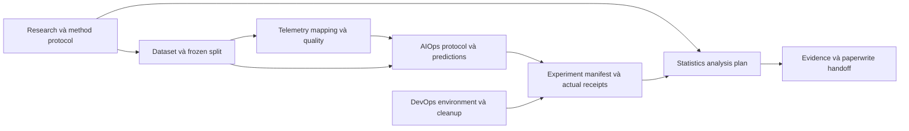

# NCKH: phương pháp, dữ liệu và nghiên cứu DevOps/AIOps

## Outcome và baseline

Nâng cấp sâu discovery/method, scientific data/statistics, telemetry và RCA/anomaly/forecasting/retrieval/agent evaluation. Tạo bốn core owners: `nckh-dataset`, `nckh-statistics`, `nckh-telemetry`, `nckh-aiops`; giữ các owner engineering/marketing và lifecycle `nckh-cook`.

**Cook được user cấp quyền ngày 06/10/2026 với `/goal ak-cook --auto`.** Baseline là r38/281 pins/39 skills/156 base IDs/9 resources, theo [delivery advisory hooks](../reports/delivery-261006-0758-default-advisory-hooks.md) và [baseline thực](../runs/nckh-upgrade-261006-0850-attempt-01/baseline.json). Snapshot r34 ở review vẫn là lịch sử. User chỉ đạo subagent kiểm chứng hooks native nhanh rồi upgrade. [Actual quick check](../reports/verification-261006-0850-quick-native-hooks.md) quan sát genuine advisory callback, `{}`/exit0; benign write bị native sandbox chặn. [Admission](../runs/nckh-upgrade-261006-0850-attempt-01/baseline-admission.json) cho phép source upgrade theo chỉ đạo này; full native qualification/44–45 của plan trước giữ pending riêng.

Candidate thực tế **r41 / 337 pins / 43 identities / 172 base IDs** = exact baseline 39/156 + bốn owner × bốn cases. Giữ 19 required families, historical 148 cases/224 cells và writer matrix riêng. Source có 13 resource groups / 35 consumer bindings; số liệu được tính từ artifacts và receipts thật.

## Constraints và non-goals

- Research-only; VI/EN artifacts, thin skills và progressive disclosure. Không duplicate writer/visual/hooks đã thuộc plan trước.
- Giữ `nckh-data` cho DB/migration; `nckh-analytics`/`nckh-experiment` cho marketing; thêm handoff khoa học rõ ràng.
- Core contracts/readers dùng stdlib. Project runtime/package/provider chọn riêng khi có task, quyền, version và budget; không cài mặc định.
- Resource access ON cho public contract; OFF chỉ internal same-base comparison. Bốn bounded reference packs có reader/rights/lineage; không đưa measurements, corpus, private logs/labels hoặc raw runs vào source/dist.
- Không generic ML/research engine, production collector/remediation, cluster/cloud deploy, fault injection, autonomous scheduler hoặc public release trong scope mặc định.
- Giả định bao phủ cả RCA/anomaly/forecasting và LLM/RAG/agent; câu hỏi ưu tiên chưa có đáp án, không ghi như user đã duyệt.

## Phases, dependency và ownership

| Phase | Kết quả cần giao | Phụ thuộc / owner | Status |
|---|---|---|---|
| [P1 Baseline và rights](./phase-01-start.md) | Handoff hậu cook, exact set, source/rights/routing freeze, pilot plan | Plan trước / controller | Completed |
| [P2 Research và statistics](./phase-02-research-and-statistics.md) | Research/method sâu hơn; statistics owner/analysis contract | P1 / research-statistics owner | Completed |
| [P3 Dataset và telemetry](./phase-03-scientific-datasets-and-telemetry.md) | Scientific intake/splits, observation mapping/quality | P1+P2 / dataset-telemetry owner | Completed |
| [P4 DevOps và AIOps](./phase-04-devops-and-aiops-methods.md) | AIOps protocol/metrics/trust; environment evidence | P2+P3 / aiops-devops owner | Completed |
| [P5 Curated resources](./phase-05-curated-research-resources.md) | Serial catalog/profile/case prerequisites; owned provenance, typed readers, bốn packs | P2–P4 / resource owner + controller | Completed |
| [P6 Experiment workflow](./phase-06-reproducible-experiment-workflows.md) | Frozen manifest, receipts, bounded real pilot + failure attempts | P3–P5 / experiment owner | Completed |
| [P7 Integration và qualification](./phase-07-integration-and-qualification.md) | Reconcile exact integration, candidate freeze, pinned gates/build/extract/previews | P1–P6 / single integration owner | Completed |

Default thực thi tuần tự; references có thể đọc song song. Shared registry/build/acceptance/schema closure/docs và freeze chỉ controller được ghi, theo handoff từng phase. [Adoption map](./source-adoption-map.md) giữ file ownership, source choices, compatibility/risk/rollback; [acceptance matrix](./acceptance-matrix.md) giữ falsifiable cases và evidence lanes.

## Chuỗi artifact

## Acceptance của implementation

1. Exact roles/routes/catalog/cases không bỏ legacy contracts; near-miss routes không thực thi sai owner.
2. Dataset/split/telemetry/statistics/AIOps/experiment artifacts có validators và meaningful failure cases; không dùng kit qualification split làm ML/incident split.
3. Bốn selected packs có truthful multi-source provenance, typed selectors, consumer/domain/locale/genre gates, relocated ON reads và OFF no-read.
4. Một bounded rights-cleared real pilot khi cook bind actual data/code/config/environment/predictions/results và failures; simulated outputs có nhãn. Không fake measurement/run/human verdict.
5. Candidate mới chỉ experimental; technical, agent, native, owner và scientific gates độc lập, có pending/unknown đúng phạm vi.
6. Full deterministic evidence, compatible legacy bundles, deterministic packaging và installer previews chỉ ghi kết quả thật ở P7; plan validation chỉ xác nhận structure.

## Planning evidence và handoff

[Scope contract](../reports/brainstorm-261005-0036-research-upgrade-contract.md), [current review](../reports/code-reviewer-261005-0036-current-research-kit.md), [scientific sources](../reports/researcher-261005-0036-scientific-sources.md), [other source kits](../reports/researcher-261005-0036-other-resource-kits.md), [primary AIOps references](../reports/researcher-261005-0036-primary-aiops-sources.md), [scientific manifest](../reports/source-manifest-261005-0036-scientific.json) và [other-source manifest](../reports/source-manifest-261005-0036-other.json). Input snapshot fingerprints và individual file hashes ở adoption map; ZIP roots thiếu Git metadata, không gán commit giả.

Implementation và routine local checks đã được cấp quyền bằng cook invocation. User cấp thêm bounded quick-native subagent check trước upgrade; actual provider/cloud/fault injection/native install/publication ngoài quick check giữ quyền theo task. Rights/pilot/runtime identity là P1/P6 execution gates.

## Validation log

Whole-plan sweep và review resolutions ở [planning validation](../reports/review-261005-0036-planning-validation.md) và [controller adjudication](../reports/red-team-261005-0036-controller-scope.md). Các checkboxes implementation được đóng theo actual cook receipts bên dưới; kết quả structural checks riêng không đóng scientific/runtime gates.

## Bàn giao implementation

[Delivery r41](../reports/delivery-261006-research-upgrade-r41.md), [experimental candidate](../runs/nckh-upgrade-261006-0850-attempt-01/experimental-candidate.json) và [final qualification review](../reports/review-261006-research-final-qualification.md) ghi kết quả thực: 311 tests (310 pass / 1 Windows symlink skip), hai-build reproducibility trên bốn host cho standalone/plugin, 16 bundles, 420 isolated resource reads, tám checker runs và tám preview bảo toàn bytes. Pilot World Bank có actual receipts và giới hạn hồi cứu / independent_n=1. 590 protected hashes không đổi; legacy format1/2 và cleanup được đối chiếu. Candidate chỉ experimental/local-package-only; semantic agent/native đầy đủ/owner/human/scientific/provider/stable/public và real install/migration giữ verdict riêng.

<!-- slug: nckh-devops-aiops-research-upgrade -->
